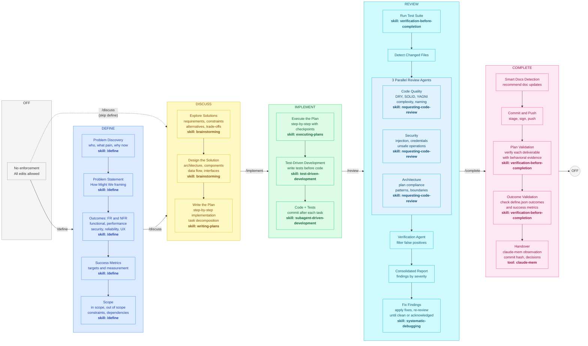

# Claude Code Workflows

[](https://www.gnu.org/licenses/gpl-3.0)

A guide to structured, accountable development with Claude Code using complementary tools:

- **Workflow Manager** — PreToolUse hooks that block code edits until a plan is discussed and approved
- **Superpowers** — Specialized skills (brainstorming, TDD, planning, debugging, code review)
- **claude-mem** — Cross-session persistent memory via MCP server
- **Status Line** — Minimal, color-coded status bar showing model, context usage, git branch, and worktree info

## CLAUDE.md Integration

**For Claude Code instances**: If your project has an existing `CLAUDE.md`, review [`claude.md.template`](claude.md.template) and merge any missing sections into your project's `CLAUDE.md`. Key sections: behavioral rules, security rules, context window management, claude-mem handover pattern. Do not replace — integrate.

## Quick Start

1. [Getting Started Guide](docs/guides/getting-started.md) - Installation and first workflow
2. [CLAUDE.md Template](claude.md.template) - Copy into your project and customize
3. [Workflow Cheatsheet](docs/quick-reference/workflow-cheatsheet.md) - Daily-use quick reference

## Workflow Manager

Six-phase workflow that prevents cowboy coding. Start by defining the problem and outcomes, then plan, implement, review, and complete. Claude **cannot** edit files until a plan is discussed and you approve it. After implementation, a multi-agent review pipeline verifies code quality, security, and architecture before the task is complete.



Any `/phase` command can jump directly to any phase. Soft gates warn when skipping recommended steps.

| Phase | Write/Edit | Bash writes | What to do |
|-------|-----------|-------------|------------|
| **OFF** | Allowed | Allowed | Normal Claude Code operation, no enforcement |
| **DEFINE** | Blocked (except specs/plans) | Blocked (except specs/plans) | Define problem, outcomes, success metrics |
| **DISCUSS** | Blocked (except specs/plans) | Blocked (except specs/plans) | Brainstorm, plan, write design specs |
| **IMPLEMENT** | Allowed | Allowed | Execute the approved plan with TDD |
| **REVIEW** | Allowed | Allowed | Multi-agent review pipeline |
| **COMPLETE** | Blocked (except docs) | Blocked (except docs) | Verified completion, outcome validation, handover |

**Commands:**
- `/define` — define the problem and outcomes (recommended first step, optional)
- `/discuss` — start a workflow (brainstorming, edits blocked)
- `/implement` — unlock code edits (plan approved, start implementing)
- `/review` — run multi-agent review pipeline (3 parallel reviewers + verification)
- `/complete` — verified completion with outcome validation (claude-mem observation, docs check, back to off)

### `/review` Pipeline

When you run `/review`, it executes a structured pipeline:
1. **Run tests** — finds and runs project test suite
2. **Detect changes** — committed + unstaged + untracked files
3. **3 parallel review agents** — Code Quality, Security, Architecture & Plan Compliance
4. **Verification agent** — filters false positives by checking findings against actual code
5. **Consolidated report** — deduplicated findings ranked by severity (🔴 Critical / 🟡 Warning / 🟢 Suggestion)
6. **User gate** — fix issues or acknowledge findings before `/complete`

### `/complete` Pipeline

When you run `/complete`, it verifies and closes the task:
1. **Pre-completion checks** — blocks if review wasn't completed
2. **Smart docs detection** — recommends documentation updates (included in commit)
3. **Commit & Push** — stage, commit with conventional message, optional push
4. **Plan validation** — if a plan file exists, verifies each deliverable with evidence (behavioral deliverables must be demonstrated, not just grep'd)
5. **Handover** — claude-mem observation with commit hash and verification results
6. **Phase transition** — resets to OFF (normal operation)

**Install into any project:**
```bash
curl -fsSL https://raw.githubusercontent.com/azevedo-home-lab/claude-code-workflows/main/install.sh | bash
```

Or clone and install manually:
```bash
git clone https://github.com/azevedo-home-lab/claude-code-workflows.git
./claude-code-workflows/install.sh /path/to/your/project
```

Uninstall: `./uninstall.sh` or manually remove `.claude/hooks/workflow-*.sh`, `.claude/hooks/bash-write-guard.sh`, `.claude/hooks/post-tool-navigator.sh`, and `.claude/commands/{define,discuss,implement,review,complete}.md`.

## Tools

### Superpowers (Skills)

Auto-activated skills that enforce discipline at each phase:

| Skill | When |
|-------|------|
| `brainstorming` | Before any creative/feature work |
| `writing-plans` | When you have requirements, before code |
| `executing-plans` | Running a plan with review checkpoints |
| `test-driven-development` | Before writing implementation code |
| `systematic-debugging` | When encountering bugs or failures |
| `verification-before-completion` | Before claiming work is done |

### claude-mem (Cross-Session Memory)

MCP server that persists observations across sessions. Replaces manual handover docs.

| Command | Purpose |
|---------|---------|
| `mem-search` | Find work from previous sessions |
| `make-plan` | Create implementation plans with context |
| `do` | Execute plans using subagents |

**Session pattern:**
- **Start**: Search claude-mem for prior context before reading handover files
- **During**: Observations saved automatically as you work
- **End**: Key decisions and findings persisted for next session

### iTerm Launcher

Launch Claude Code in a dedicated iTerm2 window with a project-aware badge (`"Claude <project-name>"`). Works from VSCode, Zed, or any terminal. See [`tools/iterm-launcher/`](tools/iterm-launcher/) for installation and IDE setup.

### YubiKey Git Signing

Git wrapper (`git-yubikey`) that shows a prominent touch banner before commit/push/tag, plus SSH wrappers that bypass macOS ssh-agent for FIDO2 signing in Claude Code's non-tty environment. See [`tools/yubikey-setup/`](tools/yubikey-setup/) for installation.

### Status Line

A minimal single-line status bar with color-coded context usage and worktree support:

```
Opus │ ▓▓░░░░░░░░ 25% (50k/200k) │  main │ ~/Projects/MyApp │ Workflow Manager ✓ [DISCUSS] │ Claude-Mem ✓
```

**Quick install:**
```bash
cp statusline/statusline.sh ~/.claude/statusline.sh
chmod +x ~/.claude/statusline.sh
```

Then add to `~/.claude/settings.json`:
```json
{
  "statusLine": {
    "type": "command",
    "command": "~/.claude/statusline.sh",
    "padding": 2
  }
}
```

See the [Status Line Guide](docs/guides/statusline-guide.md) for full details, customization, and available session data fields.

## Documentation

### Guides
- [Getting Started](docs/guides/getting-started.md) - Installation and first workflow
- [Integration Guide](docs/guides/integration-guide.md) - How Superpowers skills work together
- [Cross-Session Memory](docs/guides/claude-mem-guide.md) - claude-mem usage and handover patterns
- [Status Line](docs/guides/statusline-guide.md) - Setup, customization, and available data fields

### Reference
- [Command Reference](docs/quick-reference/commands.md) - All commands
- [Hooks Reference](docs/reference/hooks.md) - Workflow Manager hooks
- [Architecture](docs/reference/architecture.md) - System design and file organization

## Templates

- [CLAUDE.md Template](claude.md.template) - Project-specific rules including:
  - Context window management (forbidden topic rule)
  - YubiKey FIDO2 git signing setup (optional, via `tools/yubikey-setup/`)
  - Secret protection protocols
  - claude-mem integration
  - Behavioral rules for Claude Code

## Security

The template includes security rules for:
- **Secret protection**: Never display token/key values in output
- **YubiKey signing**: Optional FIDO2 commit signing and push auth
- **Token directories**: Protected paths excluded from git
- **Ownership**: All work attributed to user, never to AI

## Contributing

See [CONTRIBUTING.md](CONTRIBUTING.md) for development setup, code style, and PR process.

## License

This project is licensed under the GNU General Public License v3.0 — see [LICENSE](LICENSE) for details.
