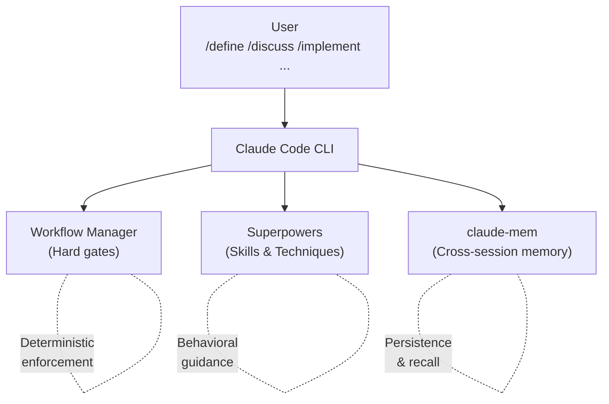

# Architecture

How Workflow Manager, Superpowers, and claude-mem work together in Claude Code.

## System Overview



## Phase Model

See [README — Workflow](../../README.md#workflow) for the phase summary table.

**OFF** → **DEFINE** → **DISCUSS** → **IMPLEMENT** → **REVIEW** → **COMPLETE** → OFF

| | DEFINE | DISCUSS | IMPLEMENT | REVIEW | COMPLETE |
|---|--------|---------|-----------|--------|----------|
| **Edits** | Blocked (specs/plans only) | Blocked (specs/plans only) | All allowed | All allowed | Blocked (docs only) |
| **Soft gate in** | — | — | Warns if no plan | Warns if no changes | Warns if no review |
| **Step 1** | Brainstorm with user (who is affected, what's the pain, why now) | Confirm problem statement (from DEFINE or brainstorm) | Read plan file → `plan_read` | Check `tests_passing` from IMPLEMENT (re-run if missing) → `verification_complete` | **Plan Validator** agent — check every deliverable exists → `plan_validated` |
| **Step 2** | **Domain Researcher** agent — search problem domain for context | **Solution Researcher A** agent — research technical approaches | Implement tasks with TDD (tests before code, red-green-refactor) | Detect changed files (`git diff` + `ls-files`) | **Outcome Validator** + **Boundary Tester** (worktree) + **Devil's Advocate** (worktree) agents → `outcomes_validated` |
| **Step 3** | **Context Gatherer** agent — search project history + claude-mem | **Solution Researcher B** agent — case studies + lessons learned | Mark `all_tasks_complete` | 5 agents in parallel: **Code Quality**, **Security**, **Architecture & Plan Compliance**, **Governance**, **Codebase Hygiene** → `agents_dispatched` | Present validation results (deliverables, outcomes, boundary tests, devil's advocate) → **Results Reviewer** agent gate → `results_presented` |
| **Step 4** | **Assumption Challenger** agent — challenge the problem framing | **Prior Art Scanner** agent — search claude-mem + codebase → `research_done` | **Versioning** agent — semver bump to plugin.json files | **Verification** agent — deduplicate, verify, rank severity | **Docs Detector** agent — detect stale docs → **Docs Reviewer** agent gate → `docs_checked` |
| **Step 5** | **Outcome Structurer** agent — measurable outcomes + verification methods | **Codebase Analyst** agent — which approaches fit the architecture | Run full test suite → `tests_passing` | Present findings (Critical / Warning / Suggestion) → `findings_presented` | Commit & push (version verify, conventional commit) → **Commit Reviewer** agent gate → `committed`, `pushed` |
| **Step 6** | **Scope Boundary Checker** agent — hidden dependencies, scope creep | **Risk Assessor** agent — risks per shortlisted approach | | User acknowledges (fix or proceed) → `findings_acknowledged` | Branch integration & worktree cleanup → `issues_reconciled` |
| **Step 7** | Write Problem section to plan (`docs/plans/`). Commit. | Present 2-3 approaches + recommendation. User selects → `approach_selected` | | | Tech debt audit (categorize, save observations, create/reconcile GitHub issues) → **Tech Debt Reviewer** agent gate → `tech_debt_audited` |
| **Step 8** | | Write implementation plan (Approaches + Decision + Tasks). Commit. Register path → `plan_written` | | | **Handover Writer** agent — save claude-mem observation → **Handover Reviewer** agent gate → `handover_saved` |
| **Step 9** | | | | | Present summary (handover ID, commit, open issues). User runs `/off` |
| **Hard gate out** | *none* | `plan_written` | `plan_read`, `tests_passing`\*, `all_tasks_complete` | `findings_acknowledged` | All 9 milestones |
| **Phase objective** | "Frame the problem and define measurable outcomes" | "Research solutions, choose one, write implementation plan" | "Build the chosen solution following the plan with TDD" | "Independent multi-agent validation of implementation quality" | "Verify outcomes were met, update docs, hand over for future sessions" |
| **Contextual nudges** | Agent return → challenge framing, separate facts from interpretations; Plan write → challenge vague outcomes, require verifiable criteria | Agent return → require stated downsides, unsourced claims are opinions; Plan write → flag scope creep, trace steps to chosen approach | Source edit → "tests first? does this follow the plan?"; Test run → "diagnose root cause, don't patch tests" | Agent return → "don't downgrade findings, verify before reporting"; Findings write → "quantify cost of not fixing" | Agent return → "be specific about failures, quantify fix effort"; Docs edit → "does handover make sense to a stranger?"; Test run → "be specific about validation failures" |
| **Anti-laziness checks** | Short agent prompts (<150 chars), skipped research (10+ calls without agent), options without recommendation, generic commits (<30 chars) | Short agent prompts, skipped research, options without recommendation, approach selected but plan not written, generic commits | No verify after 5+ source edits, tasks complete but tests not run, generic commits, stalled auto-transition | All findings downgraded to suggestions, agents dispatched but findings not presented, generic commits | Minimal handover (<200 chars), pushed but steps 7-9 incomplete, missing project field on save_observation, stalled auto-transition, generic commits |

\*`tests_passing` is skipped if no test suite is detected. Any `/phase` command can jump to any phase. Soft gates warn but never block.

Edits to `.claude/hooks/`, `plugin/scripts/`, and `plugin/commands/` are blocked in all phases (guard-system self-protection). Users can override via `!backtick`. The bash write guard (`bash-write-guard.sh`) pattern-matches ~95% of shell write operations.

## Autonomy Levels

See [README — Autonomy Levels](../../README.md#autonomy-levels) for the autonomy table.

Hooks (`workflow-gate.sh`, `bash-write-guard.sh`) are the single source of truth for write permissions. Autonomy controls checkpoint granularity (how often Claude pauses for user input), not enforcement. All autonomy levels follow the same phase-based write rules.

## File Organization

```
your-project/
├── .claude/
│   ├── hooks/                         # Enforcement hooks
│   │   ├── workflow-state.sh         # State utility
│   │   ├── workflow-cmd.sh           # Shell-independent wrapper
│   │   ├── workflow-gate.sh          # Write/Edit gate
│   │   ├── bash-write-guard.sh       # Bash write gate
│   │   └── post-tool-navigator.sh    # 3-layer coaching system
│   ├── commands/                      # Phase commands (/define, /discuss, etc.)
│   ├── state/
│   │   └── workflow.json              # Workflow state (gitignored)
│   └── settings.json                  # Hook configuration
├── docs/
│   ├── guides/                        # Getting started, claude-mem, statusline
│   ├── reference/                     # Architecture, hooks, commands
│   ├── plans/                         # Implementation plans (per-feature)
│   └── specs/                         # Design specs (per-feature)
├── CLAUDE.md                          # Project rules (committed)
└── src/                               # Your code
```

## Security

- `token_do_not_commit/` in `.gitignore`
- `.claude/state/` in `.gitignore` (session state, not committed)
- YubiKey FIDO2 signing optional (see CLAUDE.md template)
- Never commit credentials; use vault-managed secrets
- Guard-system self-protection prevents the workflow from rewriting its own rules
