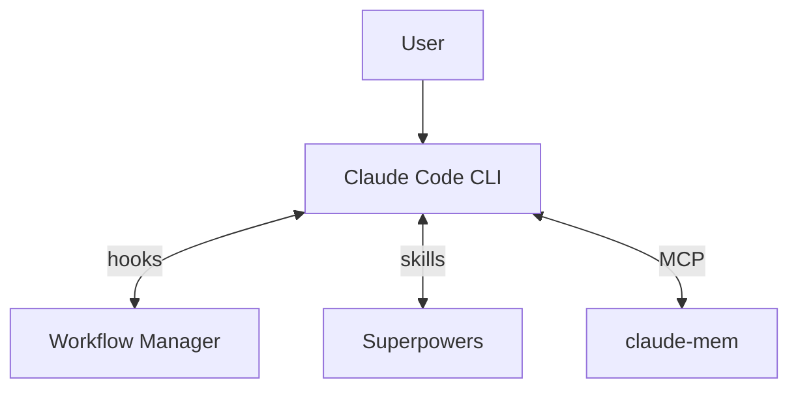

# Architecture

How Workflow Manager, Superpowers, and claude-mem work together in Claude Code.

## System Overview



| Component | Connection | What it does |
|-----------|-----------|--------------|
| **Workflow Manager** | PreToolUse + PostToolUse hooks | Gates block writes in DEFINE/DISCUSS/COMPLETE. Coaching fires phase objectives, contextual nudges, anti-laziness checks. |
| **Superpowers** | Skills invoked by Claude | Brainstorming (DEFINE/DISCUSS), executing-plans + TDD (IMPLEMENT), verification (COMPLETE). |
| **claude-mem** | MCP tools | Search prior context (DEFINE/DISCUSS), save observations + handover (COMPLETE). |

## Phase Model

See [README — Workflow](../../README.md#workflow) for the phase summary table.

**OFF** → **DEFINE** → **DISCUSS** → **IMPLEMENT** → **REVIEW** → **COMPLETE** → OFF

### Steps

| # | DEFINE | DISCUSS | IMPLEMENT | REVIEW | COMPLETE |
|---|--------|---------|-----------|--------|----------|
| 1 | Brainstorm with user (who is affected, what's the pain, why now) | Confirm problem statement (from DEFINE or brainstorm) | Write implementation plan with `writing-plans` → `plan_written` | Check `tests_passing` from IMPLEMENT (re-run if missing) → `verification_complete` | **Plan Validator** agent — check every deliverable exists → `plan_validated` |
| 2 | **Domain Researcher** agent — search problem domain for context | **Solution Researcher A** agent — research technical approaches | Read plan file → `plan_read` | Detect changed files (`git diff` + `ls-files`) | **Outcome Validator** + **Boundary Tester** (worktree) + **Devil's Advocate** (worktree) agents → `outcomes_validated` |
| 3 | **Context Gatherer** agent — search project history + claude-mem | **Solution Researcher B** agent — case studies + lessons learned | Implement tasks with TDD (tests before code, red-green-refactor) | 5 agents in parallel: **Code Quality**, **Security**, **Architecture & Plan Compliance**, **Governance**, **Codebase Hygiene** → `agents_dispatched` | Present validation results (deliverables, outcomes, boundary tests, devil's advocate) → **Results Reviewer** agent gate → `results_presented` |
| 4 | **Assumption Challenger** agent — challenge the problem framing | **Prior Art Scanner** agent — search claude-mem + codebase → `research_done` | Mark `all_tasks_complete` | **Verification** agent — deduplicate, verify, rank severity | **Docs Detector** agent — detect stale docs → **Docs Reviewer** agent gate → `docs_checked` |
| 5 | **Outcome Structurer** agent — measurable outcomes + verification methods | **Codebase Analyst** agent — which approaches fit the architecture | **Versioning** agent — semver bump to plugin.json files | Present findings (Critical / Warning / Suggestion) → `findings_presented` | Commit & push (version verify, conventional commit) → **Commit Reviewer** agent gate → `committed`, `pushed` |
| 6 | **Scope Boundary Checker** agent — hidden dependencies, scope creep | **Risk Assessor** agent — risks per shortlisted approach | Run full test suite → `tests_passing` | User acknowledges (fix or proceed) → `findings_acknowledged` | Branch integration & worktree cleanup → `issues_reconciled` |
| 7 | Write Problem section to plan (`docs/plans/`). Commit. | Present 2-3 approaches + recommendation. User selects → `approach_selected` | | | Tech debt audit (categorize, save observations, create/reconcile GitHub issues) → **Tech Debt Reviewer** agent gate → `tech_debt_audited` |
| 8 | | Commit spec. User runs `/implement` | | | **Handover Writer** agent — save claude-mem observation → **Handover Reviewer** agent gate → `handover_saved` |
| 9 | | | | | Present summary (handover ID, commit, open issues). User runs `/off` |

### Enforcement

#### Permissions

| | DEFINE | DISCUSS | IMPLEMENT | REVIEW | COMPLETE |
|---|--------|---------|-----------|--------|----------|
| **Write/Edit** | Blocked (specs/plans only) | Blocked (specs/plans only) | Allowed | Allowed | Blocked (docs only) |
| **Bash writes** | Blocked (specs/plans only) | Blocked (specs/plans only) | Allowed | Allowed | Blocked (docs only) |
| **Read/Grep/Glob/Agent** | Allowed | Allowed | Allowed | Allowed | Allowed |
| **Git / gh CLI** | Destructive\* blocked; `gh` read-only | Destructive\* blocked; `gh` read-only | Destructive\* blocked | Destructive\* blocked | Destructive\* blocked; push requires confirmation |
| **Self-protection** | Enforcement files blocked | Enforcement files blocked | Enforcement files blocked | Enforcement files blocked | Enforcement files blocked |

\*Destructive git: `reset --hard`, `push --force/-f`, `branch -D`, `checkout -- .`, `clean -f`, `rebase --abort` — blocked in all active phases. Self-protection: `.claude/hooks/`, `plugin/scripts/`, `plugin/commands/` blocked in all phases. Override via `!backtick`.

#### Gates

| | DEFINE | DISCUSS | IMPLEMENT | REVIEW | COMPLETE |
|---|--------|---------|-----------|--------|----------|
| **Soft gate in** | — | — | Warns if no plan | Warns if no changes | Warns if no review |
| **Hard gate out** | *none* | `approach_selected` | `plan_written`, `plan_read`, `tests_passing`\*, `all_tasks_complete` | `findings_acknowledged` | All 9 milestones |

\*`tests_passing` is skipped if no test suite is detected. Any `/phase` command can jump to any phase. Soft gates warn but never block.

#### Coaching

| | DEFINE | DISCUSS | IMPLEMENT | REVIEW | COMPLETE |
|---|--------|---------|-----------|--------|----------|
| **Phase objective** | Frame the problem and define measurable outcomes | Research solutions, choose one, document the decision | Write implementation plan, then build the solution with TDD | Independent multi-agent validation of implementation quality | Verify outcomes were met, update docs, hand over for future sessions |
| **Contextual nudges** | Agent return → challenge framing; Plan write → require verifiable criteria | Agent return → require stated downsides; Plan write → flag scope creep | Source edit → "tests first?"; Test run → "don't patch tests" | Agent return → "don't downgrade findings"; Findings write → "quantify cost of not fixing" | Agent return → "quantify fix effort"; Docs edit → "does handover make sense to a stranger?" |
| **Anti-laziness checks** | Short agent prompts, skipped research, options without recommendation, generic commits | Short agent prompts, skipped research, generic commits | Code before plan written, no verify after 5+ edits, tasks complete but tests not run, stalled auto-transition | All findings downgraded, agents dispatched but not presented, generic commits | Minimal handover, pushed but steps 7-9 incomplete, missing project field, stalled auto-transition |

## Autonomy Levels

See [README — Autonomy Levels](../../README.md#autonomy-levels) for the autonomy table.

Hooks (`workflow-gate.sh`, `bash-write-guard.sh`) are the single source of truth for write permissions. Autonomy controls checkpoint granularity (how often Claude pauses for user input), not enforcement. All autonomy levels follow the same phase-based write rules.

## Plugin Architecture

WFM has two locations: the **development repo** and the **deployed cache**.

### Development repo (ClaudeWorkflows)

Where plugin code is written and versioned. Not used at runtime by other projects.

```
ClaudeWorkflows/
├── .claude-plugin/
│   ├── plugin.json              # Plugin manifest (development)
│   └── marketplace.json         # Marketplace catalog (plugin list + versions)
├── plugin/                      # Plugin content — copied into cache on install
│   ├── .claude-plugin/
│   │   └── plugin.json          # Plugin manifest — must exist here so the
│   │                            # cache copy has it for Claude Code discovery
│   ├── commands/                # Slash commands (/discuss, /define, etc.)
│   ├── scripts/                 # Hook scripts and utilities
│   ├── hooks/
│   │   └── hooks.json           # Hook wiring (auto-loaded by Claude Code)
│   ├── agents/                  # Subagent definitions
│   ├── coaching/                # Coaching messages (objectives, nudges, checks)
│   ├── config/                  # Skill registry, phase config
│   ├── phases/                  # Phase-specific content
│   └── statusline/
│       └── statusline.sh        # Status bar script
├── docs/                        # Specs, plans, reference docs
├── CLAUDE.md
└── LICENSE
```

### Deployed cache

Where hooks, scripts, agents, and coaching run from. Created by `claude plugin install`.
Located at `~/.claude/plugins/cache/azevedo-home-lab/workflow-manager/<version>/`.

This is a copy of the `plugin/` directory from the development repo. Claude Code reads
`marketplace.json`, sees `"source": "./plugin"`, and copies that directory here.

```
~/.claude/plugins/cache/azevedo-home-lab/workflow-manager/<version>/
├── .claude-plugin/
│   └── plugin.json              # Claude Code needs this to discover the plugin
├── commands/                    # Source commands (templates for setup.sh to copy)
├── scripts/                     # Hook scripts (use CLAUDE_PLUGIN_ROOT)
├── hooks/
│   └── hooks.json               # Hook wiring
├── agents/                      # Subagent definitions
├── coaching/                    # Coaching messages
├── config/
├── phases/
└── statusline/
```

### User projects (e.g. homelab-infra)

Setup.sh copies commands into each project's `.claude/commands/` on session start.

```
your-project/
├── .claude/
│   ├── commands/                # WFM commands (copied by setup.sh) + project-specific
│   ├── state/
│   │   └── workflow.json        # Workflow runtime state (gitignored)
│   └── settings.json            # Project permissions
└── ...
```

### Why commands are copied to projects

Plugin commands are **namespaced** by Claude Code (e.g. `/workflow-manager:discuss`).
We want users to type `/discuss`, not `/workflow-manager:discuss`. The only way to get
un-namespaced slash commands is to place them in the project's `.claude/commands/` directory.

Setup.sh copies commands from the cache and rewrites the script paths to use the
**absolute cache path**. This is necessary because project-level commands with
`disable-model-invocation: true` run as raw shell — they don't receive `CLAUDE_PLUGIN_ROOT`
or `CLAUDE_SKILL_DIR`. The absolute path is the only reliable way to locate the scripts.

### How paths resolve

| Context | Variable | Points to |
|---------|----------|-----------|
| Hooks (`hooks.json`) | `CLAUDE_PLUGIN_ROOT` | Cache root (`~/.claude/plugins/cache/.../`) |
| Project commands (`!` backtick) | Absolute path (set by setup.sh) | Cache scripts dir |

## Versioning

When releasing a new version, update the version in **all three** files:

| File | Purpose |
|------|---------|
| `.claude-plugin/plugin.json` | Repo-level manifest (development, setup.sh dev mode) |
| `.claude-plugin/marketplace.json` | Marketplace catalog — `claude plugin install` reads the version here to name the cache directory |
| `plugin/.claude-plugin/plugin.json` | Cache-level manifest — Claude Code needs this to discover commands and agents |

If these are out of sync, `claude plugin install` creates the cache under the wrong version, or Claude Code fails to discover plugin commands.

## Security

- `token_do_not_commit/` in `.gitignore`
- `.claude/state/` in `.gitignore` (session state, not committed)
- YubiKey FIDO2 signing optional (see CLAUDE.md template)
- Never commit credentials; use vault-managed secrets
- Guard-system self-protection prevents the workflow from rewriting its own rules
