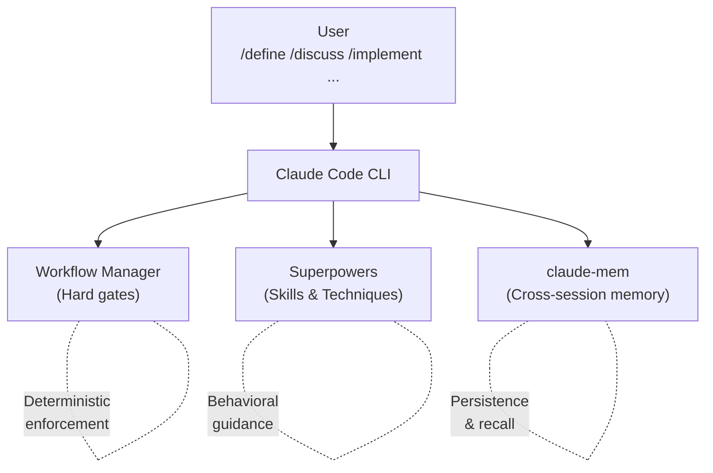

# Architecture

How Workflow Manager, Superpowers, and claude-mem work together in Claude Code.

## System Overview



## Phase Model

See [README — Workflow](../../README.md#workflow) for the phase summary table.

<table>
<tr>
<th style="width:18%">OFF</th>
<th style="width:10%; text-align:center">→<br/><em>no gate</em></th>
<th style="width:18%">DEFINE</th>
<th style="width:10%; text-align:center">→<br/><em>soft</em></th>
<th style="width:18%">DISCUSS</th>
<th style="width:10%; text-align:center">→<br/><em>plan_written</em></th>
<th style="width:18%">IMPLEMENT</th>
<th style="width:10%; text-align:center">→<br/><em>plan_read,<br/>tests_passing*,<br/>all_tasks_complete</em></th>
<th style="width:18%">REVIEW</th>
<th style="width:10%; text-align:center">→<br/><em>findings_<br/>acknowledged</em></th>
<th style="width:18%">COMPLETE</th>
</tr>
<tr>
<td>No enforcement</td>
<td></td>
<td>Brainstorming</td>
<td></td>
<td>Solution research</td>
<td></td>
<td>Read plan</td>
<td></td>
<td>Verify tests passed</td>
<td></td>
<td>Validate plan/outcomes</td>
</tr>
<tr>
<td></td>
<td></td>
<td>3 research agents</td>
<td></td>
<td>3 research agents</td>
<td></td>
<td>TDD: tests first</td>
<td></td>
<td>5 parallel agents</td>
<td></td>
<td>Docs check</td>
</tr>
<tr>
<td></td>
<td></td>
<td>Converge on problem</td>
<td></td>
<td>2 converge agents</td>
<td></td>
<td>Execute tasks</td>
<td></td>
<td>Verification agent</td>
<td></td>
<td>Commit &amp; push</td>
</tr>
<tr>
<td></td>
<td></td>
<td>Write Problem section</td>
<td></td>
<td>Write plan</td>
<td></td>
<td>Run test suite</td>
<td></td>
<td>Present findings</td>
<td></td>
<td>Tech debt + handover</td>
</tr>
</table>

\*`tests_passing` is skipped if no test suite is detected. Any `/phase` command can jump directly to any phase. Soft gates warn when skipping steps but never block.

## Autonomy Levels

See [README — Autonomy Levels](../../README.md#autonomy-levels) for the autonomy table.

Hooks (`workflow-gate.sh`, `bash-write-guard.sh`) are the single source of truth for write permissions. Autonomy controls checkpoint granularity (how often Claude pauses for user input), not enforcement. All autonomy levels follow the same phase-based write rules.

## Enforcement

| Mechanism | What it does | Fires | Bypassable? |
|-----------|-------------|-------|-------------|
| **Hard gates** (hooks) | Block Write/Edit/Bash writes in DEFINE, DISCUSS, COMPLETE | Every tool call | No |
| **Layer 1: Phase entry** | Coaching message with objective and done criteria | Once per phase entry | Yes |
| **Layer 2: Standards** | Contextual reinforcement (e.g., "tests first?" on source edit) | Once per trigger type, resets after 30 idle calls | Yes |
| **Layer 3: Anti-laziness** | Red-flag detection (short prompts, generic commits, skipped research) | Every match | Yes |

**Hard gates** are the only mechanism that blocks operations. `workflow-gate.sh` blocks Write/Edit/MultiEdit; `bash-write-guard.sh` blocks Bash write operations (redirects, `sed -i`, `cp`, `mv`, `rm`, `tee`, heredocs, scripted file writes, pipe-to-shell). Both use phase-specific whitelists — see [Write Blocking](#write-blocking).

**Layer 1** fires once when entering a phase and a tracked tool is used. Provides the phase objective and done criteria. In auto autonomy, also includes auto-transition instructions.

**Layer 2** fires once per trigger type per phase (e.g., agent return in DEFINE, source edit in IMPLEMENT). Resets after 30 tool calls without firing, so it can re-fire in long phases.

**Layer 3** fires on every match. Detects: short agent prompts (<150 chars), generic commit messages (<30 chars), all review findings downgraded, minimal handover (<200 chars), missing project field on `save_observation`, skipped research (10+ calls without agent dispatch), no test run after 5+ source edits, and stalled auto-transitions. Pipeline-abandoned detection (e.g., approach selected but plan not written) is also Layer 3.

## Gates and Milestones

### Hard Gates

| Transition | Required Milestones | Rationale |
|-----------|---------------------|-----------|
| DISCUSS → any | `plan_written` | Plan is the contract between DISCUSS and IMPLEMENT |
| IMPLEMENT → any | `plan_read`, `tests_passing`\*, `all_tasks_complete` | Proves plan was executed and tests pass |
| → COMPLETE (skipping REVIEW) | `findings_acknowledged` | Review is mandatory before completion |
| COMPLETE → OFF | All 9: `plan_validated`, `outcomes_validated`, `results_presented`, `docs_checked`, `committed`, `pushed`, `issues_reconciled`, `tech_debt_audited`, `handover_saved` | Each step produces artifacts for future sessions |

\*`tests_passing` is skipped if no test suite is detected.

### Soft Gates

- → IMPLEMENT: warns if no plan registered
- → REVIEW: warns if no code changes detected
- → COMPLETE: warns if review hasn't been run

### Milestones Per Phase

| Phase | Milestones |
|-------|-----------|
| DEFINE | *(guidance only — no tracked milestones)* |
| DISCUSS | `problem_confirmed`, `research_done`, `approach_selected`, `plan_written` |
| IMPLEMENT | `plan_read`, `tests_passing`, `all_tasks_complete` |
| REVIEW | `verification_complete`, `agents_dispatched`, `findings_presented`, `findings_acknowledged` |
| COMPLETE | `plan_validated`, `outcomes_validated`, `results_presented`, `docs_checked`, `committed`, `pushed`, `issues_reconciled`, `tech_debt_audited`, `handover_saved` |

## Write Blocking

| Tier | Phases | Allowed Writes | Blocked |
|------|--------|---------------|---------|
| Restrictive | DEFINE, DISCUSS | `.claude/state/`, `docs/plans/`, `docs/specs/` | All source code, config, other docs |
| Docs-allowed | COMPLETE | `.claude/state/`, `docs/`, root `*.md` | Source code, implementation files |
| Open | IMPLEMENT, REVIEW | Everything | Nothing |

Edits to `.claude/hooks/`, `plugin/scripts/`, and `plugin/commands/` are blocked in all phases (guard-system self-protection). Users can override via `!backtick`.

The bash write guard (`bash-write-guard.sh`) pattern-matches ~95% of shell write operations. Claude isn't adversarial — common patterns are sufficient.

## File Organization

```
your-project/
├── .claude/
│   ├── hooks/                         # Enforcement hooks
│   │   ├── workflow-state.sh         # State utility
│   │   ├── workflow-cmd.sh           # Shell-independent wrapper
│   │   ├── workflow-gate.sh          # Write/Edit gate
│   │   ├── bash-write-guard.sh       # Bash write gate
│   │   └── post-tool-navigator.sh    # 3-layer coaching system
│   ├── commands/                      # Phase commands (/define, /discuss, etc.)
│   ├── state/
│   │   └── workflow.json              # Workflow state (gitignored)
│   └── settings.json                  # Hook configuration
├── docs/
│   ├── guides/                        # Getting started, claude-mem, statusline
│   ├── reference/                     # Architecture, hooks, commands
│   ├── plans/                         # Implementation plans (per-feature)
│   └── specs/                         # Design specs (per-feature)
├── CLAUDE.md                          # Project rules (committed)
└── src/                               # Your code
```

## Security

- `token_do_not_commit/` in `.gitignore`
- `.claude/state/` in `.gitignore` (session state, not committed)
- YubiKey FIDO2 signing optional (see CLAUDE.md template)
- Never commit credentials; use vault-managed secrets
- Guard-system self-protection prevents the workflow from rewriting its own rules
