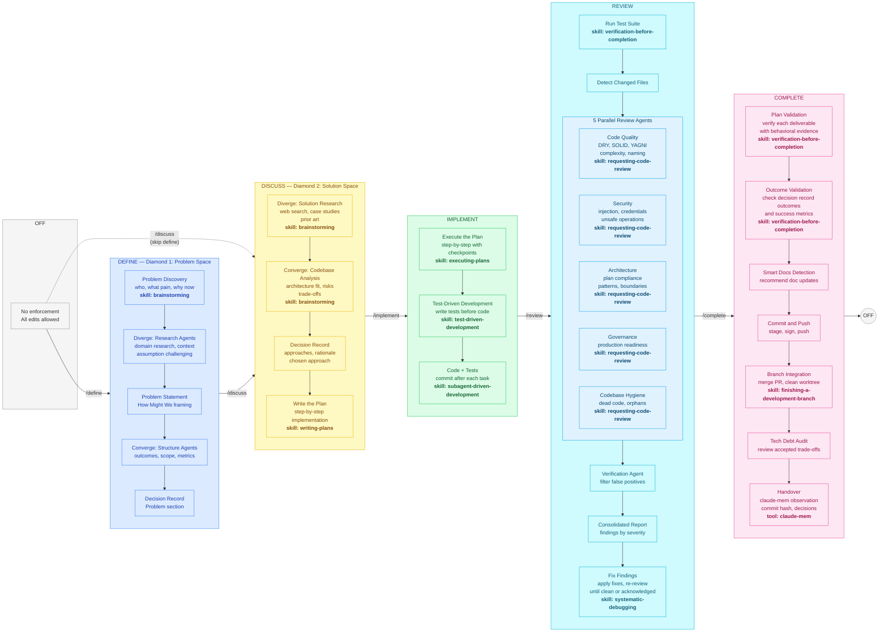

# Architecture

How Workflow Manager, Superpowers, and claude-mem work together in Claude Code.

## System Overview

```
┌─────────────────────────────────────────────────────────┐
│                        User                             │
│            /define  /implement  /discuss                   │
└───────────────────┬─────────────────────────────────────┘
                    │
                    ↓
        ┌──────────────────────────┐
        │     Claude Code CLI      │
        └──┬──────────┬────────┬──┘
           │          │        │
     ┌─────┘          │        └──────┐
     ↓                ↓               ↓
┌──────────┐  ┌──────────────┐  ┌───────────┐
│ Workflow │  │ Superpowers  │  │ claude-mem│
│ Hooks    │  │ (Skills &    │  │ (Cross-   │
│ (Hard    │  │  Techniques) │  │  session  │
│  gates)  │  │              │  │  memory)  │
└──────────┘  └──────────────┘  └───────────┘
 Deterministic   Behavioral       Persistence
 enforcement     guidance         & recall
```

## Two-Layer Enforcement

| Layer | Mechanism | What it does | Can Claude bypass? |
|-------|-----------|-------------|-------------------|
| **Hooks** | PreToolUse deny | Blocks Write/Edit in DEFINE, DISCUSS, and COMPLETE phases | No |
| **Superpowers** | Prompt instructions | Guides brainstorm → plan → execute → verify | Yes (but less likely with hooks backing it up) |

The hooks enforce the **discuss-before-code boundary**. Superpowers handles the **quality of each phase**.

## Phase Model

```
         ┌──(/define)──> DEFINE ──(/discuss)──┐
OFF ─────┤                                    ├──> DISCUSS ──(/implement)──> IMPLEMENT ──(/review)──> REVIEW ──(/complete)──> COMPLETE ──> OFF
         └──(/discuss)────────────────────────┘

Any /phase command can jump directly to any phase. Soft gates warn when skipping recommended steps.

DEFINE:     Write/Edit BLOCKED (except specs/plans), Bash writes BLOCKED (except specs/plans)
DISCUSS:    Write/Edit BLOCKED (except specs/plans), Bash writes BLOCKED (except specs/plans)
IMPLEMENT:  Everything ALLOWED
REVIEW:     Everything ALLOWED (fixes from review)
COMPLETE:   Write/Edit BLOCKED (except docs), Bash writes BLOCKED (except docs)
```

### Detailed Workflow Diagram



## Autonomy Levels

Phase and autonomy are two orthogonal dimensions of control:

- **Phase** (WHAT) — which operations are allowed at each stage of the workflow
- **Autonomy** (HOW MUCH) — how independently Claude proceeds within those permissions

| Symbol | Level | Name | Description |
|--------|-------|------|-------------|
| `▶` | off | Supervised | Step-by-step pair programming. Claude executes one plan step at a time, presents the change, and waits for review before proceeding. Writes follow phase rules. |
| `▶▶` | ask | Semi-Auto | Claude works freely within each phase but stops at phase boundaries for review and guidance before transitioning. No auto-commits. **Default.** |
| `▶▶▶` | auto | Unattended | Full autonomy. Claude auto-transitions between phases, auto-fixes review findings, auto-commits. Stops only when user input is genuinely needed or before git push. |

**Enforcement**: Hooks (`workflow-gate.sh`, `bash-write-guard.sh`) are the single source of truth and apply the autonomy check before the phase gate. Claude Code permission modes (`plan`/`default`/`acceptEdits`) are best-effort convenience that mirror the active autonomy level but are not relied upon for enforcement.

Set via `/autonomy off|ask|auto`. Only the user can change it.

## Component Responsibilities

### Workflow Manager — Hard Gates

- `workflow-gate.sh` — blocks Write/Edit/MultiEdit in DEFINE, DISCUSS, and COMPLETE phases (with different whitelist tiers)
- `bash-write-guard.sh` — blocks Bash write operations in DEFINE, DISCUSS, and COMPLETE phases
- `workflow-state.sh` — state read/write utility
- State: `.claude/state/workflow.json` (gitignored)

### Superpowers — Development Techniques

- `/superpowers:brainstorming` — requirements refinement
- `/superpowers:writing-plans` — plan generation
- `/superpowers:executing-plans` — batch execution with checkpoints
- Auto-activated skills: TDD, debugging, code review, verification, worktrees

Skills load on-demand when contextually relevant, not preloaded.

### claude-mem — Cross-Session Memory

- Persists observations (decisions, discoveries, preferences) across sessions
- `mem-search` for loading prior context at session start
- `make-plan` / `do` for plan creation and execution

## Workflow

```
DEFINE PHASE (Diamond 1 — Problem Space, edits blocked, optional):
  /define → brainstorming with problem-discovery context
  Diverge: domain research, context gathering, assumption challenging agents
  Converge: outcome structurer, scope boundary checker agents
  Output: decision record with Problem section

TRANSITION: /discuss → proceed to solution design

DISCUSS PHASE (Diamond 2 — Solution Space, edits blocked):
  /discuss → brainstorming with solution-design context
  Diverge: solution researchers, prior art scanner agents
  Converge: codebase analyst, risk assessor agents
  Output: decision record enriched with Approaches + Decision sections
  /superpowers:writing-plans → implementation plan

TRANSITION: /implement → unlock edits (soft gate: warns if no plan)

IMPLEMENT PHASE (edits allowed):
  /superpowers:executing-plans → step-by-step with checkpoints
  /superpowers:test-driven-development → tests before code

TRANSITION: /review → enter review (soft gate: warns if no changes)

REVIEW PHASE (edits allowed for fixes):
  5 parallel review agents: code quality, security, architecture, governance, codebase hygiene
  Verification agent filters false positives
  Findings persisted to decision record
  Fix issues or acknowledge

TRANSITION: /complete → enter completion (soft gate: warns if no review)

COMPLETE PHASE (code blocked, docs allowed):
  Plan validation → verify deliverables with behavioral evidence
  Outcome validation → check decision record outcomes and metrics
  Smart docs detection → recommend doc/README updates
  Commit and push
  Tech debt audit → review accepted trade-offs
  Handover → claude-mem observation with commit hash and decisions

TRANSITION: completes → back to OFF

Note: Any /phase command can jump directly to any phase.
Soft gates warn when skipping recommended steps but never block.
```

## File Organization

```
your-project/
├── .claude/
│   ├── hooks/
│   │   ├── workflow-state.sh       # State utility
│   │   ├── workflow-cmd.sh         # Shell-independent wrapper
│   │   ├── workflow-gate.sh        # Write/Edit gate
│   │   ├── bash-write-guard.sh     # Bash write gate
│   │   ├── user-phase-gate.sh      # User prompt phase authorization
│   │   └── post-tool-navigator.sh  # Phase guidance messages
│   ├── commands/
│   │   ├── define.md               # /define command
│   │   ├── discuss.md              # /discuss command
│   │   ├── implement.md            # /implement command
│   │   ├── review.md               # /review command
│   │   ├── complete.md             # /complete command
│   │   ├── off.md                  # /off command
│   │   └── autonomy.md             # /autonomy command
│   ├── state/
│   │   └── workflow.json           # Consolidated workflow state (gitignored)
│   └── settings.json               # Hook configuration
├── docs/
│   └── plans/                      # Implementation plans
├── CLAUDE.md                       # Project rules (committed)
└── src/                            # Your code
```

## Security

- `token_do_not_commit/` in `.gitignore`
- `.claude/state/` in `.gitignore` (session state, not committed)
- YubiKey FIDO2 signing optional (see CLAUDE.md template)
- Never commit credentials; use vault-managed secrets
