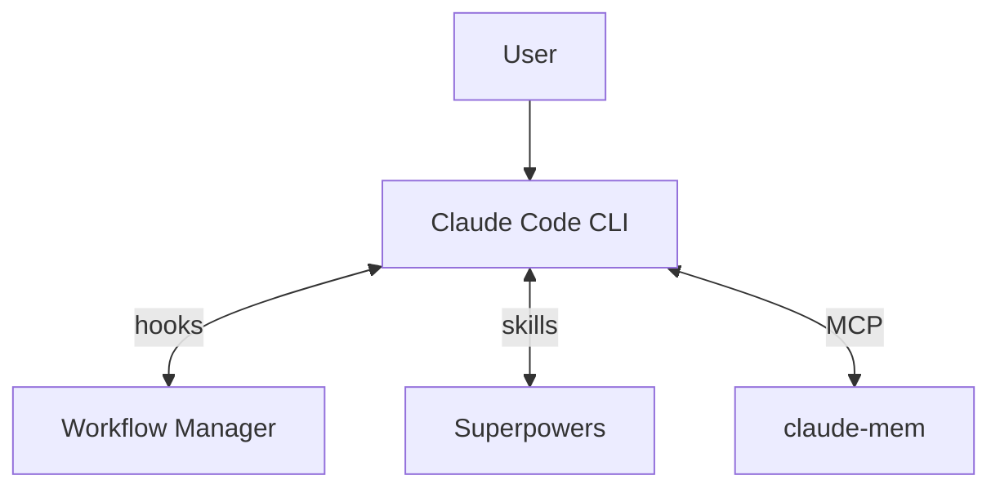

# Architecture

How Workflow Manager, Superpowers, and claude-mem work together in Claude Code.

## System Overview



| Component | Connection | What it does |
|-----------|-----------|--------------|
| **Workflow Manager** | PreToolUse + PostToolUse hooks | Gates block writes in DEFINE/DISCUSS/COMPLETE. Coaching fires phase objectives, contextual nudges, anti-laziness checks. |
| **Superpowers** | Skills invoked by Claude | Brainstorming (DEFINE/DISCUSS), executing-plans + TDD (IMPLEMENT), verification (COMPLETE). |
| **claude-mem** | MCP tools | Search prior context (DEFINE/DISCUSS), save observations + handover (COMPLETE). |

## Phase Model

See [README — Workflow](../../README.md#workflow) for the phase summary table.

**OFF** → **DEFINE** → **DISCUSS** → **IMPLEMENT** → **REVIEW** → **COMPLETE** → OFF

### Steps

| # | DEFINE | DISCUSS | IMPLEMENT | REVIEW | COMPLETE |
|---|--------|---------|-----------|--------|----------|
| 1 | Brainstorm with user (who is affected, what's the pain, why now) | Confirm problem statement (from DEFINE or brainstorm) | Write implementation plan with `writing-plans` → `plan_written` | Check `tests_passing` from IMPLEMENT (re-run if missing) → `verification_complete` | **Plan Validator** agent — check every deliverable exists → `plan_validated` |
| 2 | **Domain Researcher** agent — search problem domain for context | **Solution Researcher A** agent — research technical approaches | Read plan file → `plan_read` | Detect changed files (`git diff` + `ls-files`) | **Outcome Validator** + **Boundary Tester** (worktree) + **Devil's Advocate** (worktree) agents → `outcomes_validated` |
| 3 | **Context Gatherer** agent — search project history + claude-mem | **Solution Researcher B** agent — case studies + lessons learned | Implement tasks with TDD (tests before code, red-green-refactor) | 5 agents in parallel: **Code Quality**, **Security**, **Architecture & Plan Compliance**, **Governance**, **Codebase Hygiene** → `agents_dispatched` | Present validation results (deliverables, outcomes, boundary tests, devil's advocate) → **Results Reviewer** agent gate → `results_presented` |
| 4 | **Assumption Challenger** agent — challenge the problem framing | **Prior Art Scanner** agent — search claude-mem + codebase → `research_done` | Mark `all_tasks_complete` | **Verification** agent — deduplicate, verify, rank severity | **Docs Detector** agent — detect stale docs → **Docs Reviewer** agent gate → `docs_checked` |
| 5 | **Outcome Structurer** agent — measurable outcomes + verification methods | **Codebase Analyst** agent — which approaches fit the architecture | **Versioning** agent — semver bump to plugin.json files | Present findings (Critical / Warning / Suggestion) → `findings_presented` | Commit & push (version verify, conventional commit) → **Commit Reviewer** agent gate → `committed`, `pushed` |
| 6 | **Scope Boundary Checker** agent — hidden dependencies, scope creep | **Risk Assessor** agent — risks per shortlisted approach | Run full test suite → `tests_passing` | User acknowledges (fix or proceed) → `findings_acknowledged` | Branch integration & worktree cleanup → `issues_reconciled` |
| 7 | Write Problem section to plan (`docs/plans/`). Commit. | Present 2-3 approaches + recommendation. User selects → `approach_selected` | | | Tech debt audit (categorize, save observations, create/reconcile GitHub issues) → **Tech Debt Reviewer** agent gate → `tech_debt_audited` |
| 8 | | Commit spec. User runs `/implement` | | | **Handover Writer** agent — save claude-mem observation → **Handover Reviewer** agent gate → `handover_saved` |
| 9 | | | | | Present summary (handover ID, commit, open issues). User runs `/off` |

### Enforcement

#### Permissions

| | DEFINE | DISCUSS | IMPLEMENT | REVIEW | COMPLETE |
|---|--------|---------|-----------|--------|----------|
| **Write/Edit** | Blocked (specs/plans only) | Blocked (specs/plans only) | Allowed | Allowed | Blocked (docs only) |
| **Bash writes** | Blocked (specs/plans only) | Blocked (specs/plans only) | Allowed | Allowed | Blocked (docs only) |
| **Read/Grep/Glob/Agent** | Allowed | Allowed | Allowed | Allowed | Allowed |
| **Git / gh CLI** | Destructive\* blocked; `gh` read-only | Destructive\* blocked; `gh` read-only | Destructive\* blocked | Destructive\* blocked | Destructive\* blocked; push requires confirmation |
| **Self-protection** | Enforcement files blocked | Enforcement files blocked | Enforcement files blocked | Enforcement files blocked | Enforcement files blocked |

\*Destructive git: `reset --hard`, `push --force/-f`, `branch -D`, `checkout -- .`, `clean -f`, `rebase --abort` — blocked in all active phases. Self-protection: `.claude/hooks/`, `plugin/scripts/`, `plugin/commands/` blocked in all phases. Override via `!backtick`.

#### Gates

| | DEFINE | DISCUSS | IMPLEMENT | REVIEW | COMPLETE |
|---|--------|---------|-----------|--------|----------|
| **Soft gate in** | — | — | Warns if no plan | Warns if no changes | Warns if no review |
| **Hard gate out** | *none* | `approach_selected` | `plan_written`, `plan_read`, `tests_passing`\*, `all_tasks_complete` | `findings_acknowledged` | All 9 milestones |

\*`tests_passing` is skipped if no test suite is detected. Any `/phase` command can jump to any phase. Soft gates warn but never block.

#### Coaching

| | DEFINE | DISCUSS | IMPLEMENT | REVIEW | COMPLETE |
|---|--------|---------|-----------|--------|----------|
| **Phase objective** | Frame the problem and define measurable outcomes | Research solutions, choose one, document the decision | Write implementation plan, then build the solution with TDD | Independent multi-agent validation of implementation quality | Verify outcomes were met, update docs, hand over for future sessions |
| **Contextual nudges** | Agent return → challenge framing; Plan write → require verifiable criteria | Agent return → require stated downsides; Plan write → flag scope creep | Source edit → "tests first?"; Test run → "don't patch tests" | Agent return → "don't downgrade findings"; Findings write → "quantify cost of not fixing" | Agent return → "quantify fix effort"; Docs edit → "does handover make sense to a stranger?" |
| **Anti-laziness checks** | Short agent prompts, skipped research, options without recommendation, generic commits | Short agent prompts, skipped research, generic commits | Code before plan written, no verify after 5+ edits, tasks complete but tests not run, stalled auto-transition | All findings downgraded, agents dispatched but not presented, generic commits | Minimal handover, pushed but steps 7-9 incomplete, missing project field, stalled auto-transition |

## Autonomy Levels

See [README — Autonomy Levels](../../README.md#autonomy-levels) for the autonomy table.

Hooks (`workflow-gate.sh`, `bash-write-guard.sh`) are the single source of truth for write permissions. Autonomy controls checkpoint granularity (how often Claude pauses for user input), not enforcement. All autonomy levels follow the same phase-based write rules.

## File Organization

```
your-project/
├── .claude/
│   ├── hooks/                         # Enforcement hooks
│   │   ├── workflow-state.sh         # State utility
│   │   ├── workflow-cmd.sh           # Shell-independent wrapper
│   │   ├── workflow-gate.sh          # Write/Edit gate
│   │   ├── bash-write-guard.sh       # Bash write gate
│   │   └── post-tool-navigator.sh    # 3-layer coaching system
│   ├── commands/                      # Phase commands (/define, /discuss, etc.)
│   ├── state/
│   │   └── workflow.json              # Workflow state (gitignored)
│   └── settings.json                  # Hook configuration
├── plugin/
│   ├── coaching/                      # Coaching messages (editable prose)
│   │   ├── objectives/                # Phase entry messages
│   │   ├── nudges/                    # Contextual reminders
│   │   ├── checks/                    # Anti-laziness checks
│   │   └── auto-transition/           # Autonomy=auto appendages
│   ├── scripts/                       # Hook scripts
│   └── commands/                      # Phase commands
├── docs/
│   ├── guides/                        # Getting started, claude-mem, statusline
│   ├── reference/                     # Architecture, hooks, commands
│   ├── plans/                         # Implementation plans (per-feature)
│   └── specs/                         # Design specs (per-feature)
├── CLAUDE.md                          # Project rules (committed)
└── src/                               # Your code
```

## Security

- `token_do_not_commit/` in `.gitignore`
- `.claude/state/` in `.gitignore` (session state, not committed)
- YubiKey FIDO2 signing optional (see CLAUDE.md template)
- Never commit credentials; use vault-managed secrets
- Guard-system self-protection prevents the workflow from rewriting its own rules
