# Architecture

How Workflow Manager, Superpowers, and claude-mem work together in Claude Code.

## System Overview

```
┌─────────────────────────────────────────────────────────┐
│                        User                             │
│            /define  /implement  /discuss                   │
└───────────────────┬─────────────────────────────────────┘
                    │
                    ↓
        ┌──────────────────────────┐
        │     Claude Code CLI      │
        └──┬──────────┬────────┬──┘
           │          │        │
     ┌─────┘          │        └──────┐
     ↓                ↓               ↓
┌──────────┐  ┌──────────────┐  ┌───────────┐
│ Workflow │  │ Superpowers  │  │ claude-mem│
│ Hooks    │  │ (Skills &    │  │ (Cross-   │
│ (Hard    │  │  Techniques) │  │  session  │
│  gates)  │  │              │  │  memory)  │
└──────────┘  └──────────────┘  └───────────┘
 Deterministic   Behavioral       Persistence
 enforcement     guidance         & recall
```

## Phase Model

Six phases. Code edits are blocked until you discuss and approve a plan.

```mermaid
flowchart LR
    subgraph OFF_BOX ["OFF"]
        direction TB
        OFF_desc["No enforcement<br/>All edits allowed"]
    end

    subgraph DEFINE_BOX ["DEFINE — Diamond 1: Problem Space"]
        direction TB
        DEF_steps["<b>Steps:</b><br/>1. Problem discovery (brainstorming)<br/>2. Diverge: 3 research agents<br/>3. Converge: outcomes + scope<br/>4. Write Problem section of plan"]
        DEF_gate["<b>Soft gate out →</b> none<br/><b>Edits:</b> Blocked (specs/plans allowed)"]
    end

    subgraph DISCUSS_BOX ["DISCUSS — Diamond 2: Solution Space"]
        direction TB
        DIS_steps["<b>Steps:</b><br/>1. Solution research (brainstorming)<br/>2. Diverge: solution + prior art agents<br/>3. Converge: codebase + risk agents<br/>4. Write implementation plan"]
        DIS_gate["<b>Hard gate out →</b> plan_written<br/><b>Edits:</b> Blocked (specs/plans allowed)"]
    end

    subgraph IMPLEMENT_BOX ["IMPLEMENT"]
        direction TB
        IMP_steps["<b>Steps:</b><br/>1. Read plan<br/>2. Execute tasks (TDD)<br/>3. Version bump<br/>4. Run test suite"]
        IMP_gate["<b>Hard gate out →</b> plan_read,<br/>tests_passing*, all_tasks_complete<br/><b>Edits:</b> All allowed"]
    end

    subgraph REVIEW_BOX ["REVIEW"]
        direction TB
        REV_steps["<b>Steps:</b><br/>1. Verify tests passed<br/>2. Detect changed files<br/>3. 5 parallel review agents<br/>4. Verification agent<br/>5. Present findings"]
        REV_gate["<b>Hard gate out →</b> findings_acknowledged<br/><b>Edits:</b> All allowed (for fixes)"]
    end

    subgraph COMPLETE_BOX ["COMPLETE"]
        direction TB
        COM_steps["<b>Steps:</b><br/>1. Plan validation<br/>2. Outcome validation<br/>3. Present results<br/>4. Docs detection<br/>5. Commit & push<br/>6. Branch integration<br/>7. Tech debt audit<br/>8. Handover (claude-mem)<br/>9. Summary & close"]
        COM_gate["<b>Hard gate out →</b> all 9 milestones<br/><b>Edits:</b> Blocked (docs allowed)"]
    end

    OFF_END(("OFF"))

    OFF_BOX -- "/define" --> DEFINE_BOX
    OFF_BOX -. "/discuss<br/>(skip define)" .-> DISCUSS_BOX
    DEFINE_BOX -- "/discuss" --> DISCUSS_BOX
    DISCUSS_BOX -- "/implement" --> IMPLEMENT_BOX
    IMPLEMENT_BOX -- "/review" --> REVIEW_BOX
    REVIEW_BOX -- "/complete" --> COMPLETE_BOX
    COMPLETE_BOX --> OFF_END

    style OFF_BOX fill:#f5f5f5,stroke:#999,color:#333
    style DEFINE_BOX fill:#dbeafe,stroke:#3b82f6,color:#1e40af
    style DISCUSS_BOX fill:#fef9c3,stroke:#eab308,color:#854d0e
    style IMPLEMENT_BOX fill:#dcfce7,stroke:#22c55e,color:#166534
    style REVIEW_BOX fill:#cffafe,stroke:#06b6d4,color:#155e75
    style COMPLETE_BOX fill:#fce7f3,stroke:#ec4899,color:#9d174d
    style OFF_END fill:#f5f5f5,stroke:#999,color:#333
```



*`tests_passing` is skipped if no test suite is detected.

Any `/phase` command can jump directly to any phase. Soft gates warn when skipping recommended steps but never block.

| Phase | Edits | Diamond | Focus |
|-------|-------|---------|-------|
| **OFF** | Allowed | — | No enforcement |
| **DEFINE** | Blocked* | 1 — Problem Space | Frame problem, define outcomes |
| **DISCUSS** | Blocked* | 2 — Solution Space | Research approaches, write plan |
| **IMPLEMENT** | Allowed | — | Execute plan with TDD |
| **REVIEW** | Allowed | — | Multi-agent code review |
| **COMPLETE** | Blocked** | — | Validate outcomes, handover |

\*specs/plans allowed · \*\*docs allowed

## Autonomy Levels

Phase and autonomy are two orthogonal dimensions of control:

- **Phase** (WHAT) — which operations are allowed at each stage of the workflow
- **Autonomy** (HOW MUCH) — how independently Claude proceeds within those permissions

| Symbol | Level | Name | Description |
|--------|-------|------|-------------|
| `▶` | off | Supervised | Step-by-step pair programming. Claude executes one plan step at a time, presents the change, and waits for review before proceeding. Writes follow phase rules. |
| `▶▶` | ask | Semi-Auto | Claude works freely within each phase but stops at phase boundaries for review and guidance before transitioning. No auto-commits. **Default.** |
| `▶▶▶` | auto | Unattended | Full autonomy. Claude auto-transitions between phases, auto-fixes review findings, auto-commits. Stops only when user input is genuinely needed or before git push. |

**Enforcement**: Hooks (`workflow-gate.sh`, `bash-write-guard.sh`) are the single source of truth for write permissions. All autonomy levels follow the same phase-based rules — the difference is checkpoint granularity (instructional), not enforcement. Claude Code permission modes (`default`/`acceptEdits`/`auto`) are separate from WFM autonomy — they control tool-level prompting, not workflow discipline.

Set via `/autonomy off|ask|auto`. Only the user can change it.

## Three-Layer Enforcement

| Layer | Mechanism | Fires | Can bypass? |
|-------|-----------|-------|-------------|
| **1. Phase Entry Guidance** | Coaching message on first tool use | Once per phase entry | Yes |
| **2. Professional Standards** | Contextual reinforcement | Once per phase, resets after 30 idle tool calls | Yes |
| **3. Anti-Laziness Checks** | Red-flag detection | Every match | Yes |

Hard gates (hooks) additionally block Write/Edit operations — see [Gates and Milestones](#gates-and-milestones).

### Layer 1: Phase Entry Guidance

Fires once when entering a phase and a tracked tool is used. Provides the phase objective, context, and done criteria.

| Phase | Objective | Done When |
|-------|-----------|-----------|
| DEFINE | Frame problem, define measurable outcomes | Plan has a complete Problem section with measurable outcomes |
| DISCUSS | Research solutions, select approach, write plan | Plan has Approaches + Decision sections, plan file created |
| IMPLEMENT | Build solution following plan with TDD | All plan steps implemented, tests passing |
| REVIEW | Multi-agent validation, present findings | Findings acknowledged by user |
| COMPLETE | Verify outcomes, docs, handover | All 9 completion steps done |

### Layer 2: Professional Standards Reinforcement

Fires once per phase when contextual triggers match (e.g., agent returns in DEFINE, source edit in IMPLEMENT). Resets after 30 tool calls without firing.

| Phase | Trigger | Example Message |
|-------|---------|-----------------|
| DEFINE | Agent return | "Challenge the first framing. Separate facts from interpretations." |
| DISCUSS | Plan write | "Does every plan step trace to the chosen approach? Flag scope creep." |
| IMPLEMENT | Source edit | "Does this follow the plan? Tests written first?" |
| REVIEW | Agent return | "Don't downgrade findings. Verify before reporting." |
| COMPLETE | Docs edit | "Does the handover make sense to a stranger? Is tech debt visible?" |

### Layer 3: Anti-Laziness Checks

Fires on every match. Detects patterns that indicate shortcuts or abandoned work:

| Check | Trigger | Phases |
|-------|---------|--------|
| Short agent prompts | < 150 chars | All |
| Generic commit messages | < 30 chars | All |
| All findings downgraded | No Critical/Warning entries | REVIEW |
| Minimal handover | < 200 chars | COMPLETE |
| Missing project field | `save_observation` without project | All |
| Skipping research | > 10 tool calls since last Agent | DEFINE, DISCUSS |
| Options without recommendation | Agent returned, no recommendation | All |
| No verify after code change | 5+ source edits without test run | IMPLEMENT, REVIEW |
| Pipeline abandoned | Phase-specific incomplete work | DISCUSS, IMPLEMENT, REVIEW, COMPLETE |

## Gates and Milestones

### Hard Gates

Hard gates block phase transitions when milestones are incomplete:

| Transition | Required Milestones | Rationale |
|-----------|---------------------|-----------|
| DISCUSS → any | `plan_written` | The plan is the contract between DISCUSS and IMPLEMENT |
| IMPLEMENT → any | `plan_read`, `tests_passing`\*, `all_tasks_complete` | Proves the plan was executed and tests pass |
| Skip REVIEW → COMPLETE | `findings_acknowledged` | Review is mandatory before completion |
| COMPLETE → OFF | All 9: `plan_validated`, `outcomes_validated`, `results_presented`, `docs_checked`, `committed`, `pushed`, `issues_reconciled`, `tech_debt_audited`, `handover_saved` | Each step produces artifacts for future sessions |

\*`tests_passing` is skipped if no test suite is detected (no pytest.ini, jest.config.\*, Cargo.toml, go.mod, or test/ directories).

### Soft Gates

Soft gates warn but don't block:

| Transition | Warning |
|-----------|---------|
| → IMPLEMENT | "No plan registered for this workflow cycle." |
| → REVIEW | "No code changes detected." |
| → COMPLETE | "Review hasn't been run." |

### Milestones Per Phase

| Phase | Milestones |
|-------|-----------|
| DEFINE | *(guidance only — no tracked milestones)* |
| DISCUSS | `problem_confirmed`, `research_done`, `approach_selected`, `plan_written` |
| IMPLEMENT | `plan_read`, `tests_passing`, `all_tasks_complete` |
| REVIEW | `verification_complete`, `agents_dispatched`, `findings_presented`, `findings_acknowledged` |
| COMPLETE | `plan_validated`, `outcomes_validated`, `results_presented`, `docs_checked`, `committed`, `pushed`, `issues_reconciled`, `tech_debt_audited`, `handover_saved` |

## Write Blocking

### Whitelist Tiers

| Tier | Phases | Allowed Writes | Blocked |
|------|--------|---------------|---------|
| Restrictive | DEFINE, DISCUSS | `.claude/state/`, `docs/plans/`, `docs/specs/` | All source code, config, other docs |
| Docs-allowed | COMPLETE | `.claude/state/`, `docs/` (all), root `*.md` | Source code, implementation files |
| Open | IMPLEMENT, REVIEW | Everything | Nothing |

### Guard-System Self-Protection

In all phases, edits to `.claude/hooks/`, `plugin/scripts/`, and `plugin/commands/` are blocked. The workflow cannot rewrite its own rules. Users can override via `!backtick` commands.

### Bash Write Guard

The `bash-write-guard.sh` script blocks shell write operations (redirects, `sed -i`, `cp`, `mv`, `rm`, `tee`, `curl -o`, heredocs, `python`/`node`/`ruby`/`perl` file writes, pipe-to-shell, etc.) in restrictive phases.

Exceptions: `git commit`, workflow state calls, `gh` read-only ops in DEFINE/DISCUSS, `gh` all ops in COMPLETE, `rm .claude/tmp/` cleanup in COMPLETE, and redirects to `/dev/null`.

## Pipeline-Abandoned Detection

Layer 3 coaching detects when work is abandoned mid-pipeline:

| Phase | Pattern | Detection |
|-------|---------|-----------|
| DISCUSS | Approach selected, plan not written | `approach_selected=true && plan_written=false` |
| IMPLEMENT | Tasks complete, tests not run | `all_tasks_complete=true && tests_passing=false` |
| REVIEW | Agents dispatched, findings not presented | `agents_dispatched=true && findings_presented=false` |
| COMPLETE | Pushed, but Steps 7-9 incomplete | `pushed=true && handover_saved=false` |

## Component Responsibilities

### Workflow Manager — Hard Gates

- `workflow-gate.sh` — blocks Write/Edit/MultiEdit in DEFINE, DISCUSS, and COMPLETE phases (with phase-specific whitelist tiers)
- `bash-write-guard.sh` — blocks Bash write operations in DEFINE, DISCUSS, and COMPLETE phases
- `workflow-state.sh` — state read/write utility (phase, autonomy, debug, coaching, milestones)
- `post-tool-navigator.sh` — three-layer coaching system (PostToolUse)
- State: `.claude/state/workflow.json` (gitignored)
- Debug mode (`/debug on`): makes all hook decisions visible to the user via stderr

### Superpowers — Development Skills

Manual commands (workflow-driven):

| Command | When | Output |
|---------|------|--------|
| `/superpowers:brainstorming` | DEFINE, DISCUSS | Structured Q&A, refined requirements |
| `/superpowers:writing-plans` | DISCUSS | Implementation plan with testing steps |
| `/superpowers:executing-plans` | IMPLEMENT | Batch execution with review checkpoints |

Auto-activated skills (context-driven):

| Skill | Triggers When |
|-------|--------------|
| TDD | Creating new functions/modules |
| Systematic Debugging | Error logs or stack traces |
| Code Review | Refactoring existing code |
| Verification | Before claiming completion |
| Worktrees | Multiple features in parallel |

Skills load on-demand when contextually relevant, not preloaded.

### claude-mem — Cross-Session Memory

- Persists observations (decisions, discoveries, preferences) across sessions
- `mem-search` for loading prior context at session start
- `make-plan` / `do` for plan creation and execution
- Project-scoped via git remote name

## File Organization

```
your-project/
├── .claude/
│   ├── hooks/                         # Enforcement hooks
│   │   ├── user-set-phase.sh         # User-only phase transition (!backtick)
│   │   ├── workflow-state.sh         # State utility
│   │   ├── workflow-cmd.sh           # Shell-independent wrapper
│   │   ├── workflow-gate.sh          # Write/Edit gate
│   │   ├── bash-write-guard.sh       # Bash write gate
│   │   └── post-tool-navigator.sh    # 3-layer coaching system
│   ├── commands/                      # Phase commands (/define, /discuss, etc.)
│   ├── state/
│   │   └── workflow.json              # Workflow state (gitignored)
│   └── settings.json                  # Hook configuration
├── docs/
│   ├── guides/                        # Getting started, claude-mem, statusline
│   ├── reference/                     # Architecture, hooks, commands
│   ├── plans/                         # Implementation plans (per-feature)
│   └── specs/                         # Design specs (per-feature)
├── CLAUDE.md                          # Project rules (committed)
└── src/                               # Your code
```

## Security

- `token_do_not_commit/` in `.gitignore`
- `.claude/state/` in `.gitignore` (session state, not committed)
- YubiKey FIDO2 signing optional (see CLAUDE.md template)
- Never commit credentials; use vault-managed secrets
- Guard-system self-protection prevents the workflow from rewriting its own rules
