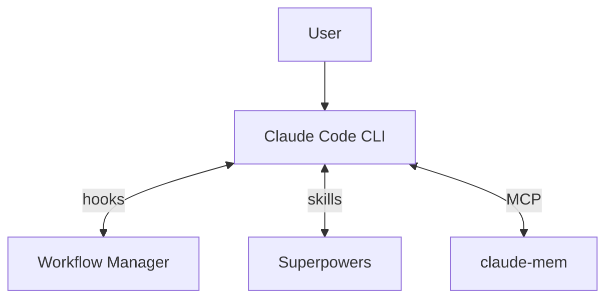

# Architecture

How Workflow Manager, Superpowers, and claude-mem work together in Claude Code.

## System Overview



| Component | Connection | What it does |
|-----------|-----------|--------------|
| **Workflow Manager** | PreToolUse + PostToolUse hooks | Gates block writes in DEFINE/DISCUSS/COMPLETE. Coaching fires phase objectives, contextual nudges, anti-laziness checks. |
| **Superpowers** | Skills invoked by Claude | Brainstorming (DEFINE/DISCUSS), executing-plans + TDD (IMPLEMENT), verification (COMPLETE). |
| **claude-mem** | MCP tools | Search prior context (DEFINE/DISCUSS), save observations + handover (COMPLETE). |

## Phase Model

See [README — Workflow](../../README.md#workflow) for the phase summary table.

**OFF** → **DEFINE** → **DISCUSS** → **IMPLEMENT** → **REVIEW** → **COMPLETE** → OFF

<table>
<tr>
<th style="width:10%"></th>
<th style="width:18%; background:#dbeafe; color:#1e40af">DEFINE</th>
<th style="width:18%; background:#fef9c3; color:#854d0e">DISCUSS</th>
<th style="width:18%; background:#dcfce7; color:#166534">IMPLEMENT</th>
<th style="width:18%; background:#e0e7ff; color:#3730a3">REVIEW</th>
<th style="width:18%; background:#fce7f3; color:#9d174d">COMPLETE</th>
</tr>
<!-- Enforcement -->
<tr style="background:#f8f8f8">
<td><strong>Edits</strong></td>
<td>🔒 Blocked (specs/plans only)</td>
<td>🔒 Blocked (specs/plans only)</td>
<td>✅ All allowed</td>
<td>✅ All allowed</td>
<td>🔒 Blocked (docs only)</td>
</tr>
<tr style="background:#f8f8f8">
<td><strong>Soft gate in</strong></td>
<td>—</td>
<td>—</td>
<td>⚠️ Warns if no plan</td>
<td>⚠️ Warns if no changes</td>
<td>⚠️ Warns if no review</td>
</tr>
<!-- Steps -->
<tr>
<td><strong>Step 1</strong></td>
<td>Brainstorm with user (who is affected, what's the pain, why now)</td>
<td>Confirm problem statement (from DEFINE or brainstorm)</td>
<td>Read plan file → <code>plan_read</code></td>
<td>Check <code>tests_passing</code> from IMPLEMENT (re-run if missing) → <code>verification_complete</code></td>
<td><strong>Plan Validator</strong> agent — check every deliverable exists → <code>plan_validated</code></td>
</tr>
<tr style="background:#fafafa">
<td><strong>Step 2</strong></td>
<td><strong>Domain Researcher</strong> agent — search problem domain for context</td>
<td><strong>Solution Researcher A</strong> agent — research technical approaches</td>
<td>Implement tasks with TDD (tests before code, red-green-refactor)</td>
<td>Detect changed files (<code>git diff</code> + <code>ls-files</code>)</td>
<td><strong>Outcome Validator</strong> + <strong>Boundary Tester</strong> (worktree) + <strong>Devil's Advocate</strong> (worktree) agents → <code>outcomes_validated</code></td>
</tr>
<tr>
<td><strong>Step 3</strong></td>
<td><strong>Context Gatherer</strong> agent — search project history + claude-mem</td>
<td><strong>Solution Researcher B</strong> agent — case studies + lessons learned</td>
<td>Mark <code>all_tasks_complete</code></td>
<td>5 agents in parallel: <strong>Code Quality</strong>, <strong>Security</strong>, <strong>Architecture &amp; Plan Compliance</strong>, <strong>Governance</strong>, <strong>Codebase Hygiene</strong> → <code>agents_dispatched</code></td>
<td>Present validation results (deliverables, outcomes, boundary tests, devil's advocate) → <strong>Results Reviewer</strong> agent gate → <code>results_presented</code></td>
</tr>
<tr style="background:#fafafa">
<td><strong>Step 4</strong></td>
<td><strong>Assumption Challenger</strong> agent — challenge the problem framing</td>
<td><strong>Prior Art Scanner</strong> agent — search claude-mem + codebase → <code>research_done</code></td>
<td><strong>Versioning</strong> agent — semver bump to plugin.json files</td>
<td><strong>Verification</strong> agent — deduplicate, verify, rank severity</td>
<td><strong>Docs Detector</strong> agent — detect stale docs → <strong>Docs Reviewer</strong> agent gate → <code>docs_checked</code></td>
</tr>
<tr>
<td><strong>Step 5</strong></td>
<td><strong>Outcome Structurer</strong> agent — measurable outcomes + verification methods</td>
<td><strong>Codebase Analyst</strong> agent — which approaches fit the architecture</td>
<td>Run full test suite → <code>tests_passing</code></td>
<td>Present findings (Critical / Warning / Suggestion) → <code>findings_presented</code></td>
<td>Commit &amp; push (version verify, conventional commit) → <strong>Commit Reviewer</strong> agent gate → <code>committed</code>, <code>pushed</code></td>
</tr>
<tr style="background:#fafafa">
<td><strong>Step 6</strong></td>
<td><strong>Scope Boundary Checker</strong> agent — hidden dependencies, scope creep</td>
<td><strong>Risk Assessor</strong> agent — risks per shortlisted approach</td>
<td></td>
<td>User acknowledges (fix or proceed) → <code>findings_acknowledged</code></td>
<td>Branch integration &amp; worktree cleanup → <code>issues_reconciled</code></td>
</tr>
<tr>
<td><strong>Step 7</strong></td>
<td>Write Problem section to plan (<code>docs/plans/</code>). Commit.</td>
<td>Present 2-3 approaches + recommendation. User selects → <code>approach_selected</code></td>
<td></td>
<td></td>
<td>Tech debt audit (categorize, save observations, create/reconcile GitHub issues) → <strong>Tech Debt Reviewer</strong> agent gate → <code>tech_debt_audited</code></td>
</tr>
<tr style="background:#fafafa">
<td><strong>Step 8</strong></td>
<td></td>
<td>Write implementation plan (Approaches + Decision + Tasks). Commit. Register path → <code>plan_written</code></td>
<td></td>
<td></td>
<td><strong>Handover Writer</strong> agent — save claude-mem observation → <strong>Handover Reviewer</strong> agent gate → <code>handover_saved</code></td>
</tr>
<tr>
<td><strong>Step 9</strong></td>
<td></td>
<td></td>
<td></td>
<td></td>
<td>Present summary (handover ID, commit, open issues). User runs <code>/off</code></td>
</tr>
<!-- Gates -->
<tr style="background:#fee2e2">
<td><strong>Hard gate out</strong></td>
<td><em>none</em></td>
<td><code>plan_written</code></td>
<td><code>plan_read</code>, <code>tests_passing</code>*, <code>all_tasks_complete</code></td>
<td><code>findings_acknowledged</code></td>
<td>All 9 milestones</td>
</tr>
<!-- Coaching -->
<tr style="background:#f0fdf4">
<td><strong>Phase objective</strong></td>
<td>Frame the problem and define measurable outcomes</td>
<td>Research solutions, choose one, write implementation plan</td>
<td>Build the chosen solution following the plan with TDD</td>
<td>Independent multi-agent validation of implementation quality</td>
<td>Verify outcomes were met, update docs, hand over for future sessions</td>
</tr>
<tr style="background:#f0fdf4">
<td><strong>Contextual nudges</strong></td>
<td>Agent return → challenge framing, separate facts from interpretations; Plan write → challenge vague outcomes, require verifiable criteria</td>
<td>Agent return → require stated downsides, unsourced claims are opinions; Plan write → flag scope creep, trace steps to chosen approach</td>
<td>Source edit → "tests first? does this follow the plan?"; Test run → "diagnose root cause, don't patch tests"</td>
<td>Agent return → "don't downgrade findings, verify before reporting"; Findings write → "quantify cost of not fixing"</td>
<td>Agent return → "be specific about failures, quantify fix effort"; Docs edit → "does handover make sense to a stranger?"; Test run → "be specific about validation failures"</td>
</tr>
<tr style="background:#f0fdf4">
<td><strong>Anti-laziness checks</strong></td>
<td>Short agent prompts (&lt;150 chars), skipped research (10+ calls without agent), options without recommendation, generic commits (&lt;30 chars)</td>
<td>Short agent prompts, skipped research, options without recommendation, approach selected but plan not written, generic commits</td>
<td>No verify after 5+ source edits, tasks complete but tests not run, generic commits, stalled auto-transition</td>
<td>All findings downgraded to suggestions, agents dispatched but findings not presented, generic commits</td>
<td>Minimal handover (&lt;200 chars), pushed but steps 7-9 incomplete, missing project field on save_observation, stalled auto-transition, generic commits</td>
</tr>
</table>

\*`tests_passing` is skipped if no test suite is detected. Any `/phase` command can jump to any phase. Soft gates warn but never block.

Edits to `.claude/hooks/`, `plugin/scripts/`, and `plugin/commands/` are blocked in all phases (guard-system self-protection). Users can override via `!backtick`. The bash write guard (`bash-write-guard.sh`) pattern-matches ~95% of shell write operations.

## Autonomy Levels

See [README — Autonomy Levels](../../README.md#autonomy-levels) for the autonomy table.

Hooks (`workflow-gate.sh`, `bash-write-guard.sh`) are the single source of truth for write permissions. Autonomy controls checkpoint granularity (how often Claude pauses for user input), not enforcement. All autonomy levels follow the same phase-based write rules.

## File Organization

```
your-project/
├── .claude/
│   ├── hooks/                         # Enforcement hooks
│   │   ├── workflow-state.sh         # State utility
│   │   ├── workflow-cmd.sh           # Shell-independent wrapper
│   │   ├── workflow-gate.sh          # Write/Edit gate
│   │   ├── bash-write-guard.sh       # Bash write gate
│   │   └── post-tool-navigator.sh    # 3-layer coaching system
│   ├── commands/                      # Phase commands (/define, /discuss, etc.)
│   ├── state/
│   │   └── workflow.json              # Workflow state (gitignored)
│   └── settings.json                  # Hook configuration
├── docs/
│   ├── guides/                        # Getting started, claude-mem, statusline
│   ├── reference/                     # Architecture, hooks, commands
│   ├── plans/                         # Implementation plans (per-feature)
│   └── specs/                         # Design specs (per-feature)
├── CLAUDE.md                          # Project rules (committed)
└── src/                               # Your code
```

## Security

- `token_do_not_commit/` in `.gitignore`
- `.claude/state/` in `.gitignore` (session state, not committed)
- YubiKey FIDO2 signing optional (see CLAUDE.md template)
- Never commit credentials; use vault-managed secrets
- Guard-system self-protection prevents the workflow from rewriting its own rules
